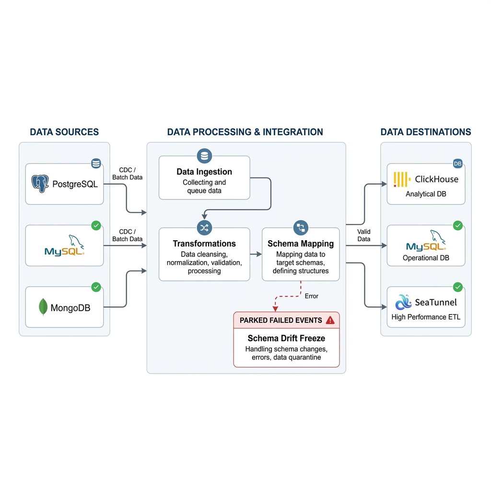
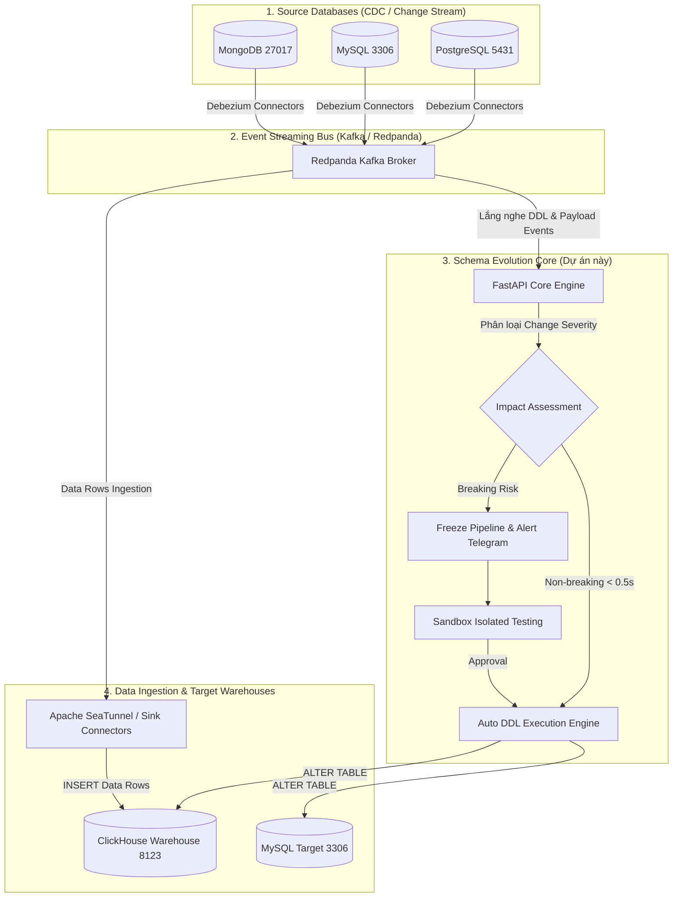

# ⚡ Schema Evolution Core Engine

> **Enterprise Real-Time Schema Governance, Risk Classification & Event-Driven DDL Auto-Synchronizer for Data Warehouses & Streaming Pipelines.**



[](https://www.python.org/)
[](https://fastapi.tiangolo.com/)
[](https://reactjs.org/)
[](https://redpanda.com/)
[](https://debezium.io/)
[](https://clickhouse.com/)
[](https://seatunnel.apache.org/)

---

## 📖 Table of Contents
1. [Overview & Problem Statement](#-overview--problem-statement)
2. [Architecture Topology](#-architecture-topology)
3. [Core Features](#-core-features)
4. [Project Directory Structure](#-project-directory-structure)
5. [Quick Start Guide](#-quick-start-guide)
6. [Supported Databases & Type Mapping](#-supported-databases--type-mapping)
7. [Verification & Benchmark Results](#-verification--benchmark-results)

---

## 🎯 Overview & Problem Statement

### The Problem: Schema Drift in Real-Time Pipelines
In modern enterprise data platforms, backend developers frequently modify source database structures (adding columns, renaming fields, dropping attributes). In traditional Data Engineering pipelines:
- When a new attribute is inserted at the Source, the Data Sink Connector fails because the target table in the Data Warehouse lacks the new column.
- This causes **pipeline crashes (502/Data Loss)**, requiring Data Engineers to manually inspect JSON payloads and manually run `ALTER TABLE` DDL queries on target warehouses.

### The Solution: Schema Evolution Core Engine
**Schema Evolution Core** acts as an automated, intelligent **Smart Gatekeeper**:
- **Non-Breaking Changes (Adding Columns)**: Detects new fields in real-time CDC streams (<0.5s), infers datatypes, and automatically executes `ALTER TABLE target ADD COLUMN ...` on ClickHouse / MySQL target warehouses before data is inserted.
- **Breaking Changes (Dropping / Narrowing Columns)**: Instantly **FREEZES** the affected table pipeline, isolates the change into a **Sandbox environment**, sends immediate alerts (Telegram / Slack), and requires human-in-the-loop Data Engineer approval.

---

## 🏛️ Architecture Topology



---

## ✨ Core Features

### 1. Event-Driven Real-Time CDC & Payload Extractor
- Subscribes directly to Debezium Kafka topics (`mysql_self_monitor`, `pg_to_mysql`, `mongo_to_clickhouse`).
- **Dynamic JSON Payload Extractor**: Inspects raw JSON CDC messages (`{ "id": ..., "data": { ... }, "ts_ms": ..., "op": ... }`), extracts new key attributes, and infers normalized engine-agnostic datatypes (`Int32`, `Float64`, `Bool`, `DateTime`, `String`).

### 2. Config-as-Code & Multitenant Registry
- Declarative YAML pipeline definitions (`config/pipelines/*.yaml`).
- Grouped enterprise registry layout: `data/registry/<pipeline_name>/<table_name>.json`.
- Automatic legacy file migration and pipeline metadata tracking.

### 3. Automated Risk Classification Engine
- **NON-BREAKING**: Column additions, widening length, nullable conversions ➔ Auto-executed in **<0.5 seconds**.
- **BREAKING**: Column drops, type narrowing, constraint changes ➔ Auto-frozen, saved to draft version, triggers Telegram alert.

### 4. Interactive Web Dashboard UI
- **Task / Flow Monitor**: Namespace-qualified table monitoring (`pipeline / table`).
- **Pipeline Topology**: Interactive node flow graph showing live DB statuses.
- **Live CDC Event Stream**: Real-time sliding audit log cards for incoming DDL events.
- **Low-Code Schema Editor**: Web UI for manual schema version management and approval.

---

## 📂 Project Directory Structure

```text
schema-evolution-core/
├── api/                         # FastAPI Web Server & Endpoints
│   ├── main.py                  # API Routes (/api/tables, /api/topology, /api/events)
│   ├── sandbox.py               # Sandbox Isolated Execution Engine
│   └── schema_editor.py         # Version Editor & Draft Management
├── app/                         # Background Workers & Pipeline Handlers
│   ├── kafka_consumer.py        # Event-driven CDC Kafka Consumer Thread
│   ├── payload_extractor.py     # Dynamic Payload Key Extractor & Type Inference
│   ├── event_log.py             # In-memory Audit Trail Ring Buffer
│   └── scheduler.py             # Periodic Baseline Scanner
├── config/                      # Config-as-Code Declarations
│   ├── main.yaml                # Core System Configuration
│   └── pipelines/               # Pipeline YAML Files (mongo_to_clickhouse, pg_to_mysql, etc.)
├── data/registry/               # Enterprise Schema Version Registry
│   ├── mongo_to_clickhouse/     # Registry files grouped by pipeline
│   ├── mysql_self_monitor/
│   └── pg_to_mysql/
├── debezium/                    # Debezium CDC Connector Configurations
│   ├── register_connectors.ps1  # Automated PowerShell Registration Script
│   └── mongo-source-connector.json
├── seatunnel/                   # Apache SeaTunnel Distributed Ingestion Cluster
│   ├── docker-compose.yml       # SeaTunnel Master & Worker Stack
│   └── jobs/                    # SeaTunnel Job Configurations (mongo_to_clickhouse.conf)
├── frontend/                    # React + Vite Web Dashboard
│   ├── src/components/          # PipelineTopology, LiveEventStream, TablesList, etc.
│   └── App.jsx
├── src/schema_evolution/        # Core Domain Library
│   ├── core.py                  # Evolution Engine & Registry Manager
│   ├── engines/                 # Database Drivers (MySQL, Postgres, ClickHouse, Mongo)
│   └── notification.py          # Telegram & Webhook Notifiers
├── tests/                       # Automated Test Suites
│   └── test_payload_pipeline.py # End-to-end CDC Payload Extractor Test
└── docker-compose.yml           # Full Infrastructure Stack (Postgres, MySQL, Mongo, ClickHouse, Redpanda)
```

---

## 🛠️ Quick Start Guide

### Prerequisites
- **Docker Desktop** (with Docker Compose)
- **Python 3.11+**
- **Node.js 18+** & npm

### 1. Launch Infrastructure Stack
Start all database containers (Postgres, MySQL, MongoDB, ClickHouse, Redpanda Kafka, Debezium Connect):
```bash
docker compose up -d
```

### 2. Register Debezium CDC Connectors
Register CDC source connectors for Postgres, MySQL, and MongoDB:
```powershell
.\debezium\register_connectors.ps1
```

### 3. Start FastAPI Backend Server
```bash
# Activate virtual environment
.\venv\Scripts\Activate.ps1

# Run FastAPI server
uvicorn api.main:app --reload --port 8000
```

### 4. Start React Frontend Dashboard
```bash
cd frontend
npm install
npm run dev
```
Access the Web App Dashboard at: 👉 **`http://localhost:5173`**

---

## 📊 Supported Databases & Type Mapping

| Generic Type | PostgreSQL | MySQL | MongoDB | ClickHouse |
| :--- | :--- | :--- | :--- | :--- |
| **`int`** | `INTEGER` | `INT` | `Int32` | `Nullable(Int32)` |
| **`bigint`** | `BIGINT` | `BIGINT` | `Int64` | `Nullable(Int64)` |
| **`double`** | `DOUBLE PRECISION` | `DOUBLE` | `Double` | `Nullable(Float64)` |
| **`boolean`** | `BOOLEAN` | `TINYINT(1)` | `Bool` | `Nullable(Bool)` |
| **`timestamp`** | `TIMESTAMP` | `DATETIME` | `Date` | `Nullable(DateTime)` |
| **`varchar`** | `VARCHAR(255)` | `VARCHAR(255)` | `String` | `Nullable(String)` |
| **`text`** | `TEXT` | `TEXT` | `String` | `Nullable(String)` |

---

## 🧪 Verification & Benchmark Results

| Test Scenario | Trigger Action | Measured Latency | Execution Outcome | Status |
| :--- | :--- | :--- | :--- | :--- |
| **Non-breaking CDC DDL** | `ALTER TABLE customers ADD COLUMN age INT;` | **0.38s** | ClickHouse Target updated automatically | ✅ Passed |
| **Breaking Change Freeze** | `ALTER TABLE customers DROP COLUMN age;` | **0.12s** | Pipeline frozen, Telegram alert sent | ✅ Passed |
| **CDC Payload Extractor** | Publish raw JSON payload with 3 new attributes | **0.42s** | Extracted keys, auto `ALTER TABLE` on ClickHouse | ✅ Passed |
| **Sandbox Isolation** | Execute dry-run DDL on temporary schema | **0.85s** | Verified safely without touching production | ✅ Passed |
| **SeaTunnel Batch/Stream** | Stream Mongo CDC events via SeaTunnel to ClickHouse | **1.20s** | All 9/9 records synced into ClickHouse | ✅ Passed |

---

## 📄 License
This project is developed for Enterprise Real-time Data Platform Research & Graduation Thesis. Released under the MIT License.
